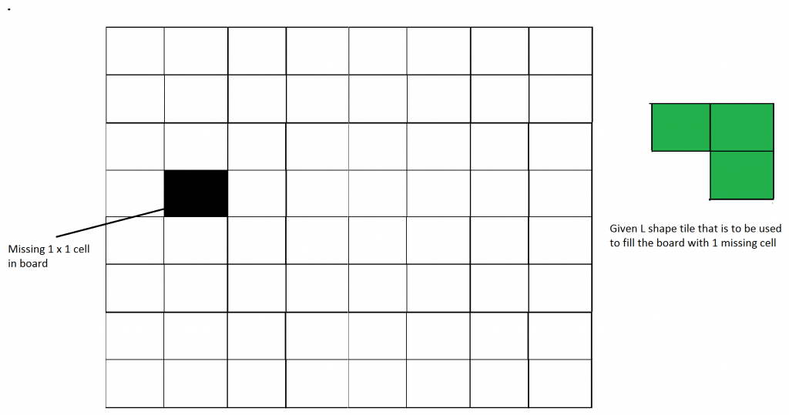
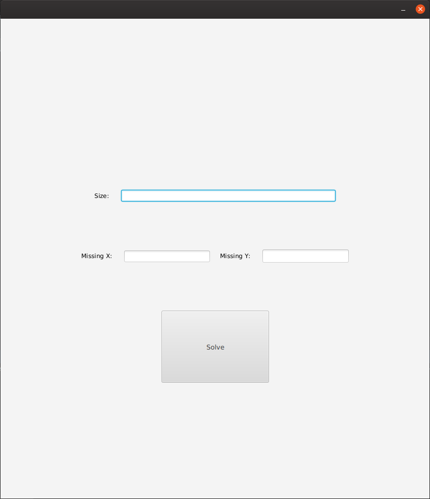
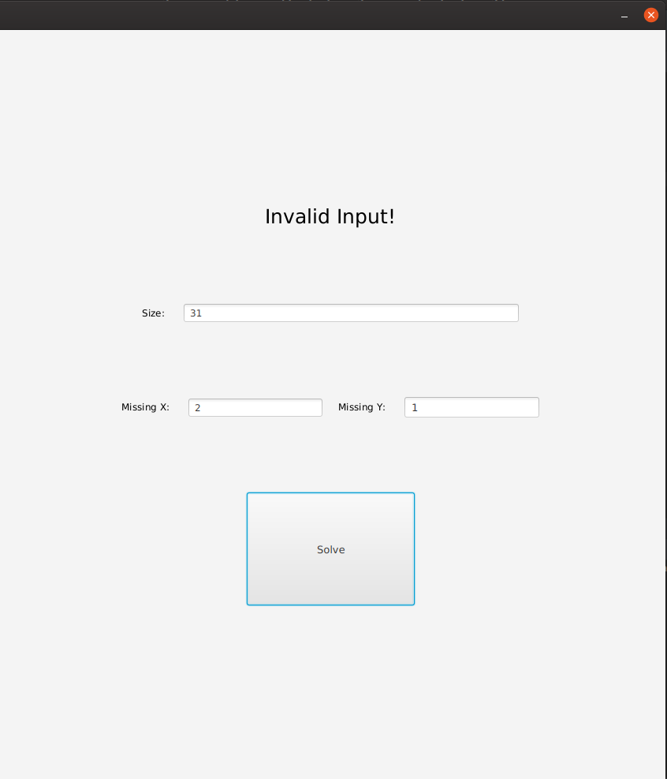
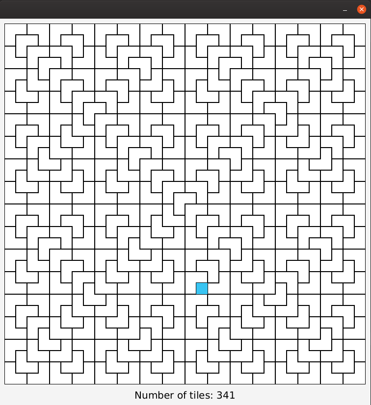

## Tiling Problem

Given a n by n board where n is of form 2 ^ k where k >= 1 (Basically n is a power of 2 with minimum value as 2). The board has one missing cell (of size 1 x 1). Fill the board using L shaped tiles. A L shaped tile is a 2 x 2 square with one cell of size 1×1 missing.

## The program

The program was written in java11 and javafx was used for graphics implementation. Also I used intelliJ community edition IDE.

to recompile and run this program using intelliJ you need to configure javafx.

[How to configure javafx in intelliJ IDE](https://www.jetbrains.com/help/idea/javafx.html )

## Instructions

In the first screen you should enter size of the board (n) and missing tile x and y. (0 <= x, y < n) Then you should press the solve button.

If you enter an invalid input you get a message like this:

If you have entered correct input the solution will be shown on a page like this (solution for n = 32, x = 17, y = 23):

